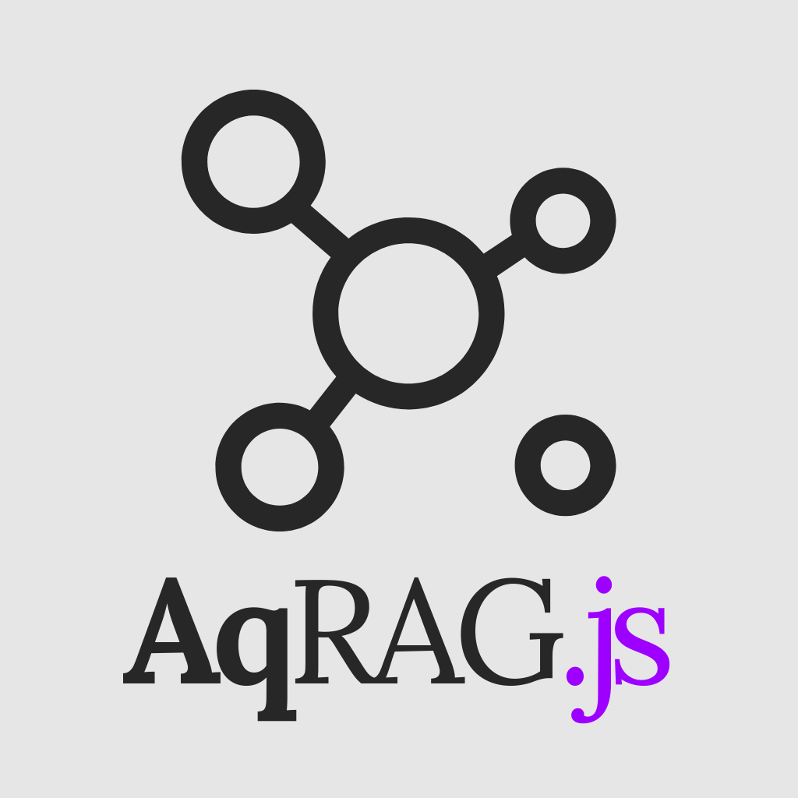

<h1 align="center">Aquiles-RAG-JS</h1>

  

> 🚧 **Warning:** This version is still under development and **not** recommended for production use.  
> ⚠️ For a stable production release, please use the original [Aquiles-RAG](https://github.com/Aquiles-ai/Aquiles-RAG).

[Aquiles-RAG](https://github.com/Aquiles-ai/Aquiles-RAG) JS variant made in [Fastify](https://fastify.dev/) to continue the high-performance philosophy of the Python version with FastAPI

We will maintain the endpoints and high-level logic outlined in Aquiles-RAG to share documentation and facilitate adoption.